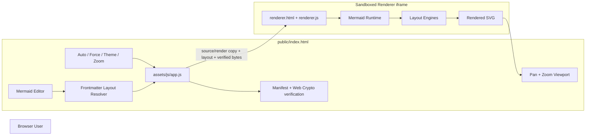
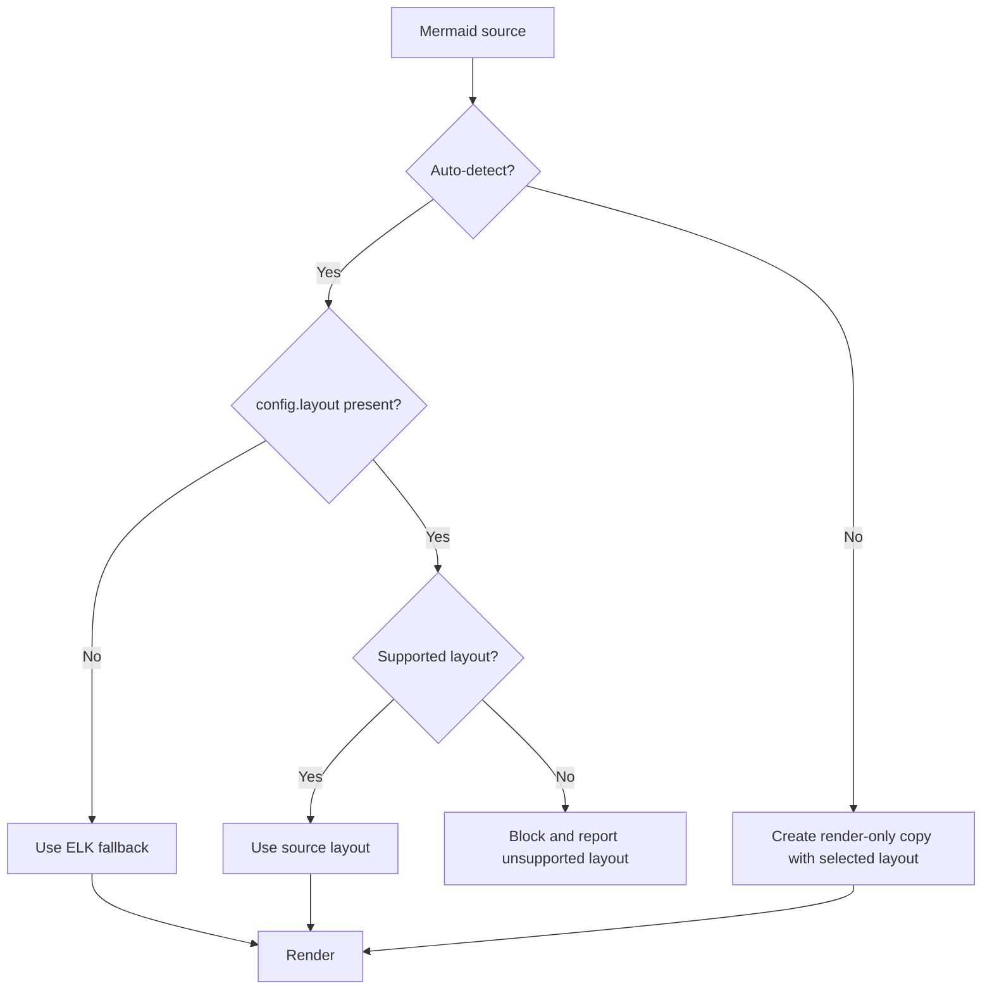

# 🏗️ Architecture

This document describes Mermaid Viewer's static runtime, security boundaries, integrity model and v1.3 layout-resolution behaviour.

## Goals

Mermaid Viewer is designed to:

- compare the same Mermaid source under multiple layout algorithms;
- honour an explicit layout stored in Mermaid frontmatter;
- make the resolved layout visible before publishing elsewhere;
- use **ELK as the viewer fallback** when the source does not specify a layout;
- allow manual layout experiments without silently rewriting the source;
- remain a static GitHub Pages application;
- keep Mermaid execution isolated from the parent editor page.

## Runtime overview



## Application layers

### Parent application

`public/assets/js/app.js` controls UI state, integrity preparation, layout resolution, iframe lifecycle, zoom/pan and persistence.

`public/assets/js/core.js` contains pure functions for:

- Mermaid semantic-version validation;
- layout/theme normalisation;
- zoom and fit calculations;
- narrow Mermaid frontmatter layout detection;
- forced render-copy generation; and
- Auto/Forced layout resolution.

### Renderer boundary

The renderer remains in an iframe with:

```html
sandbox="allow-scripts"
```

`allow-same-origin` is deliberately omitted. Parent/renderer messages remain bound to the expected iframe window and a random per-session channel ID.

Mermaid continues to initialise with:

```javascript
securityLevel: "strict"
```

The v1.3 layout feature does not weaken the v1.2 executable-integrity model.

## Layout resolution

Mermaid Viewer now has two layout modes.

### Auto-detect — default

The source is authoritative when it explicitly contains a supported layout:

```yaml
---
config:
  layout: dagre
---
```

Resolution flow:



The resolver recognises:

```yaml
config:
  layout: elk
```

and the legacy flowchart-specific hints:

```yaml
config:
  flowchart:
    defaultRenderer: dagre-wrapper
```

Legacy `dagre-wrapper` maps to `dagre`; legacy `elk` maps to `elk`. If both modern `config.layout` and a legacy flowchart hint are present, the modern layout directive takes precedence.

### Forced mode

Choosing a layout manually switches the viewer to forced mode.

Mermaid frontmatter has enough authority to override host initialisation, so forcing a layout cannot be implemented reliably by only changing `mermaid.initialize()`. Instead, the parent creates an **in-memory render copy** of the source and ensures that copy contains the selected `config.layout`.

For example, the editor may contain:

```yaml
---
config:
  layout: dagre
---
```

while forced ELK internally renders:

```yaml
---
config:
  layout: elk
---
```

The textarea is never changed. Copying or committing the editor text therefore preserves exactly what the user supplied.

### Frontmatter parser scope

The project deliberately does **not** add a general YAML parser for this feature. The layout detector is a narrow parser supporting the forms Mermaid Viewer needs:

- block `config.layout`;
- inline `config: { ..., layout: ... }`;
- quoted scalar layout values;
- trailing YAML comments; and
- legacy `config.flowchart.defaultRenderer`.

Unsupported or malformed layout directives fail visibly rather than being silently normalised to another engine.

## Layout engines

| Layout | Purpose | Loading model |
| --- | --- | --- |
| `elk` | Layered/orthogonal architecture diagrams | Verified external `@mermaid-js/layout-elk` bundle |
| `tidy-tree` | Hierarchical/tree layouts | Verified external `@mermaid-js/layout-tidy-tree` bundle |
| `cose-bilkent` | Force-directed layouts | Built into the full Mermaid browser bundle |
| `dagre` | Layered flowcharts | Built into Mermaid |

ELK remains the viewer fallback in Auto-detect mode when the source is silent.

## Source preservation

A core v1.3 invariant is:

> The viewer may transform an internal render copy, but it does not silently rewrite user Mermaid source.

This matters when the diagram is eventually copied to GitHub or another documentation platform. Auto-detect shows what the **source itself requests**. Forced mode is explicitly a local comparison tool.

## Persistence and migration

The parent stores:

```text
mermaid-viewer-layout
mermaid-viewer-layout-mode
```

New users default to `layout-mode = auto`.

A browser profile upgraded from v1.2 may already contain a saved layout but no saved mode. v1.3 interprets that state as `forced` so the upgrade does not unexpectedly alter an existing user's previews.

## Integrity model

The executable trust model introduced in v1.2 remains unchanged:

1. trusted Mermaid/layout artefacts have repository-controlled SHA-384 metadata;
2. the parent fetches and verifies them;
3. the sandbox repeats the known digest check before execution;
4. unknown Mermaid versions require explicit version-scoped consent; and
5. a known digest mismatch is blocked without bypass.

Auto-detection affects only which already-supported layout stack is selected; it does not bypass integrity coverage.

## Static deployment

GitHub Pages publishes only `public/`. No backend is required.

The existing CI and Pages workflows continue to run `npm run check`, which verifies reproducible vendored artefacts and runs the Node test suite before deployment.

## Design constraints

- **Static-first:** no application server.
- **Auto-aware:** explicit source layout wins in Auto-detect mode.
- **ELK fallback:** source without a layout still renders with ELK.
- **Source-preserving:** forced previewing never silently alters editor content.
- **Fail visibly:** unsupported source layouts are reported rather than silently changed.
- **Sandboxed:** Mermaid execution stays outside the parent's origin privileges.
- **Integrity-aware:** layout selection does not bypass executable verification.
