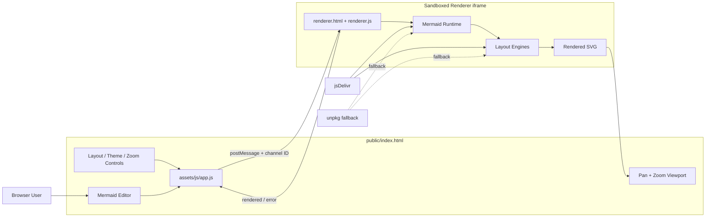
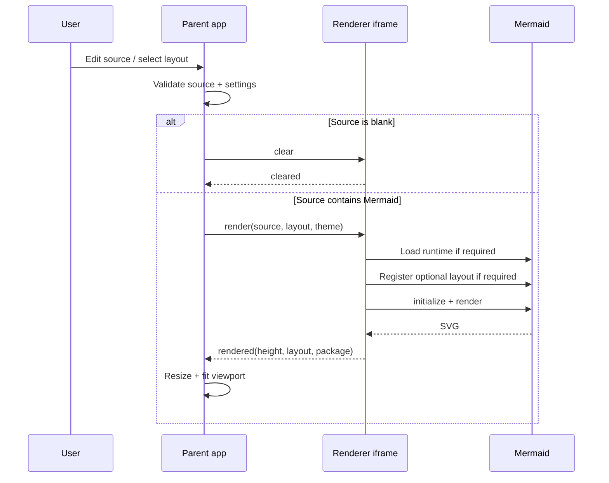

# 🏗️ Architecture

This document describes the runtime architecture, security boundaries and layout-loading model used by Mermaid Viewer.

## Goals

Mermaid Viewer is intentionally a small static application. It is designed to:

- compare the same Mermaid source under multiple layout algorithms;
- keep **ELK** as the default layout for compact architecture diagrams;
- make it easy to compare output before publishing the diagram elsewhere;
- run without an application server or build step;
- deploy directly from `public/` to GitHub Pages;
- keep Mermaid rendering isolated from the editor page.

## Runtime overview



## Application layers

### Parent application

`public/index.html` contains the editor, controls, viewport and footer.

`public/assets/js/app.js` is responsible for:

- reading UI state;
- validating the requested Mermaid version;
- selecting one of the supported layouts;
- persisting settings to `localStorage`;
- sending render requests to the sandboxed iframe;
- validating renderer responses;
- managing zoom, pan, fit and fullscreen behaviour;
- clearing the preview when the editor contains only whitespace;
- populating the footer year from the client's browser clock.

Pure, unit-testable calculations and normalisation functions live in `public/assets/js/core.js`.

### Renderer boundary

`public/renderer.html` is loaded in an iframe with:

```html
sandbox="allow-scripts"
```

`allow-same-origin` is deliberately omitted. This prevents the renderer iframe from being treated as the same origin as the parent page.

The parent and renderer communicate with `postMessage`. Each renderer session receives a random channel ID. Messages are accepted only when:

- they come from the expected iframe window;
- they contain the expected source marker; and
- they contain the active channel ID.

The renderer uses Mermaid with:

```javascript
securityLevel: "strict"
```

## Layout engine model

The layout selector exposes the four layouts documented by Mermaid:

| Layout | Purpose | Loading model |
| --- | --- | --- |
| `elk` | Layered/orthogonal layout, especially useful for architecture diagrams | External `@mermaid-js/layout-elk` package |
| `tidy-tree` | Hierarchical/tree-oriented layout | External `@mermaid-js/layout-tidy-tree` package |
| `cose-bilkent` | Force-directed graph layout | Included in Mermaid's full ESM build |
| `dagre` | Layered graph layout and Mermaid's traditional default | Included in Mermaid |

Official layout documentation:

- https://mermaid.ai/open-source/config/layouts.html

The external packages are loaded only when their layout is selected. They are registered using Mermaid's `registerLayoutLoaders()` API.

### Pinned layout packages

The static renderer currently pins:

```text
@mermaid-js/layout-elk       0.2.1
@mermaid-js/layout-tidy-tree 0.2.2
```

Mermaid itself remains selectable in the UI and defaults to `11.15.0`.

This separation is intentional: Mermaid and its optional layout packages have independent release versions.

## Render lifecycle



## CDN and fallback behaviour

The renderer is a static application, so browser-side Mermaid packages are loaded from public CDNs.

For each dependency, the renderer attempts:

1. jsDelivr
2. unpkg as a fallback

No Mermaid source is intentionally sent to a remote rendering API. The CDN supplies executable JavaScript; rendering occurs in the browser sandbox.

The CDN is therefore still part of the application's supply chain.

## Security boundaries

### Parent page CSP

`public/index.html` uses a restrictive Content Security Policy. Application scripts, styles, frames and images are restricted to the static application's own origin.

### Sandboxed execution

Untrusted Mermaid source is rendered inside the sandboxed iframe rather than directly in the parent DOM.

### Message validation

The random renderer channel reduces the chance of unrelated window messages being accepted as renderer responses.

### Mermaid strict mode

Mermaid is initialised with `securityLevel: "strict"` to reduce unsafe HTML/link behaviour inside diagrams.

## Static deployment

GitHub Pages publishes only:

```text
public/
```

The deployment workflow:

1. checks out the repository;
2. runs the Node.js unit tests;
3. configures GitHub Pages;
4. uploads `public/` as the Pages artifact; and
5. deploys it to the `github-pages` environment.

There is no production Node.js server and no server-side state.

## Repository structure

```text
.
├── .github/
│   ├── dependabot.yml
│   └── workflows/
│       ├── ci.yml
│       └── pages.yml
├── public/
│   ├── .nojekyll
│   ├── index.html
│   ├── renderer.html
│   └── assets/
│       ├── css/
│       │   └── app.css
│       ├── js/
│       │   ├── app.js
│       │   ├── core.js
│       │   ├── protocol.js
│       │   └── renderer.js
│       └── images/
│           └── github-mark.svg
├── tests/
│   ├── core.test.js
│   ├── protocol.test.js
│   └── static-site.test.js
├── ARCHITECTURE.md
├── LICENSE
├── README.md
├── SECURITY.md
└── package.json
```

## Design constraints

- **Static-first:** no backend is required.
- **ELK-first:** ELK remains the default, while all supported layouts can be compared quickly.
- **Source preservation:** changing layout does not rewrite the user's Mermaid source.
- **Isolation:** rendering remains outside the parent document's origin privileges.
- **Version visibility:** the Mermaid runtime version is explicit and editable.
- **Fail visibly:** layout/runtime errors are surfaced in the UI rather than silently falling back to a different layout.
