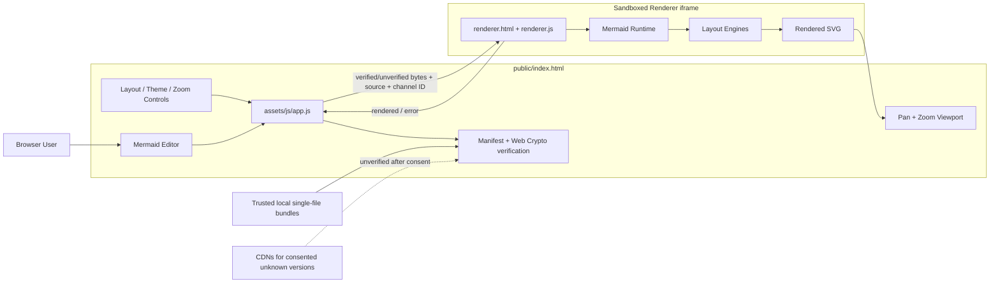
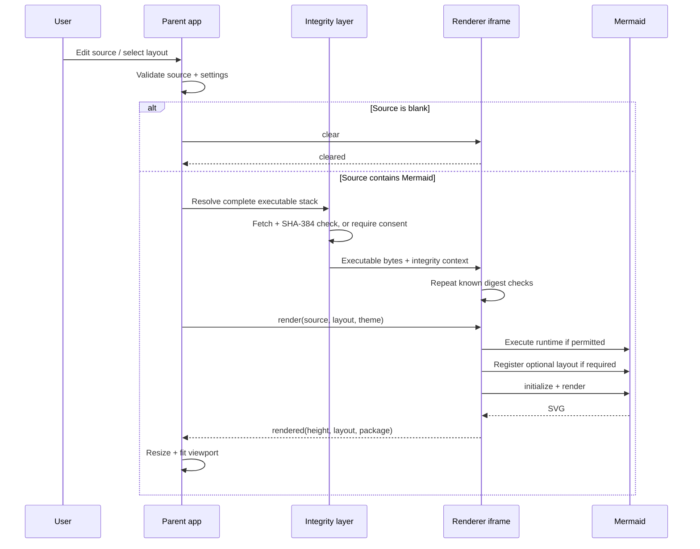
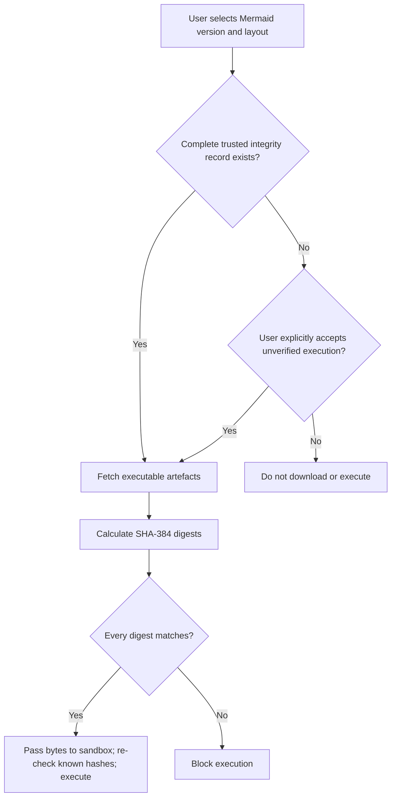

# 🏗️ Architecture

This document describes the runtime architecture, security boundaries and layout-loading model used by Mermaid Viewer.

## Goals

Mermaid Viewer is intentionally a small static application. It is designed to:

- compare the same Mermaid source under multiple layout algorithms;
- keep **ELK** as the default layout for compact architecture diagrams;
- make it easy to compare output before publishing the diagram elsewhere;
- run without an application server or build step;
- deploy directly from `public/` to GitHub Pages;
- keep Mermaid rendering isolated from the editor page.

## Runtime overview



## Application layers

### Parent application

`public/index.html` contains the editor, controls, viewport and footer.

`public/assets/js/app.js` is responsible for:

- reading UI state;
- validating the requested Mermaid version;
- looking up trusted integrity metadata and collecting explicit consent when it is absent;
- downloading and hashing executable artefacts before passing their bytes to the renderer;
- selecting one of the supported layouts;
- persisting settings to `localStorage`;
- sending render requests to the sandboxed iframe;
- validating renderer responses;
- managing zoom, pan, fit and fullscreen behaviour;
- clearing the preview when the editor contains only whitespace;
- populating the footer year from the client's browser clock.

Pure, unit-testable calculations and normalisation functions live in `public/assets/js/core.js`. Trusted-version lookup, download handling, consent helpers and digest comparison live in `public/assets/js/integrity.js`. The generated repository-controlled manifest is `public/assets/js/externals/mermaid-integrity.js`.

### Renderer boundary

`public/renderer.html` is loaded in an iframe with:

```html
sandbox="allow-scripts"
```

`allow-same-origin` is deliberately omitted. This prevents the renderer iframe from being treated as the same origin as the parent page.

The parent and renderer communicate with `postMessage`. Each renderer session receives a random channel ID. Messages are accepted only when:

- they come from the expected iframe window;
- they contain the expected source marker; and
- they contain the active channel ID.

The renderer uses Mermaid with:

```javascript
securityLevel: "strict"
```

The iframe repeats SHA-384 verification for known artefacts before turning the supplied bytes into a Blob-backed classic script. This avoids granting `allow-same-origin`, avoids `eval()`/`new Function()`, and avoids the incomplete protection that would result from checking only an ESM entry point while allowing unchecked imported chunks.

## Layout engine model

The layout selector exposes the four layouts documented by Mermaid:

| Layout | Purpose | Loading model |
| --- | --- | --- |
| `elk` | Layered/orthogonal layout, especially useful for architecture diagrams | External `@mermaid-js/layout-elk` package |
| `tidy-tree` | Hierarchical/tree-oriented layout | External `@mermaid-js/layout-tidy-tree` package |
| `cose-bilkent` | Force-directed graph layout | Included in Mermaid's full browser bundle |
| `dagre` | Layered graph layout and Mermaid's traditional default | Included in Mermaid |

Official layout documentation:

- https://mermaid.ai/open-source/config/layouts.html

The external packages are loaded only when their layout is selected. They are reproducibly bundled as single files and registered using Mermaid's `registerLayoutLoaders()` API.

### Pinned layout packages

The static renderer currently pins:

```text
@mermaid-js/layout-elk       0.2.1
@mermaid-js/layout-tidy-tree 0.2.2
```

Mermaid itself remains selectable in the UI and defaults to `11.15.0`. The trusted-version dropdown also includes the locally bundled `11.17.2` release, while a custom option accepts other complete semantic versions.

This separation is intentional: Mermaid and its optional layout packages have independent release versions.

## Render lifecycle



## Trust decision flow



There are three externally visible outcomes:

- **Verified:** every executable in the selected stack has an expected digest and matches it.
- **Unverified:** integrity metadata was absent and the user explicitly approved that exact Mermaid version for the current selection or stored a remembered browser approval.
- **Failed:** a known digest did not match; execution is blocked with no override.

## Artefact and CDN behaviour

Both trusted Mermaid versions and both optional layouts use committed, single-file bundles. `scripts/vendor-externals.mjs` copies each pinned Mermaid browser build, bundles each optional layout and writes SHA-384 digests into the manifest. `package-lock.json` pins registry integrity, and `npm run vendor:check` independently rebuilds and compares every output in CI.

This single-file approach was selected because Mermaid's ESM entry imports many executable chunks. Hashing only that entry would not authenticate the code that ultimately executes.

For an unknown Mermaid version, and only after current or remembered version-specific consent, the parent tries:

1. jsDelivr
2. unpkg as a fallback

The requested version must first pass strict semantic-version validation, and it is URL-encoded into fixed URL templates. `latest`, paths, query strings and script fragments are rejected. No Mermaid source is sent to either CDN; only executable JavaScript is downloaded. A fallback source does not make an unknown version verified.

## Security boundaries

### Parent page CSP

`public/index.html` uses a restrictive Content Security Policy. Scripts, styles, frames and images are restricted to the static application's own origin. `connect-src` additionally lists only jsDelivr and unpkg for explicitly approved unknown-version downloads.

The renderer has its own CSP. Its opaque sandbox origin means `'self'` cannot reliably authorize the bootstrap files, so the static script tags carry a CSP nonce. `strict-dynamic` and `blob:` permit that bootstrap to execute the already-fetched bytes. The static nonce is an explicit execution allow-list, not a server-generated injection defence. `script-src` permits neither `unsafe-eval` nor `unsafe-inline`.

Mermaid emits diagram-specific SVG `<style>` elements and style attributes, so the renderer's `style-src` must permit inline CSS. Without that narrowly scoped exception, browsers discard Mermaid's theme rules and render nodes using incorrect black SVG defaults. The exception is contained inside the opaque-origin sandbox and does not relax script execution.

### Sandboxed execution

Untrusted Mermaid source is rendered inside the sandboxed iframe rather than directly in the parent DOM.

### Message validation

The random renderer channel reduces the chance of unrelated window messages being accepted as renderer responses.

### Mermaid strict mode

Mermaid is initialised with `securityLevel: "strict"` to reduce unsafe HTML/link behaviour inside diagrams.

## Static deployment

GitHub Pages publishes only:

```text
public/
```

The deployment workflow:

1. checks out the repository;
2. installs exact dependencies, reproduces trusted artefacts, and runs the Node.js tests;
3. configures GitHub Pages;
4. uploads `public/` as the Pages artifact; and
5. deploys it to the `github-pages` environment.

There is no production Node.js server and no server-side state.

## Repository structure

```text
.
├── .github/
│   ├── dependabot.yml
│   └── workflows/
│       ├── ci.yml
│       └── pages.yml
├── public/
│   ├── .nojekyll
│   ├── index.html
│   ├── renderer.html
│   └── assets/
│       ├── css/
│       │   └── app.css
│       ├── js/
│       │   ├── app.js
│       │   ├── core.js
│       │   ├── integrity.js
│       │   ├── protocol.js
│       │   ├── renderer.js
│       │   └── externals/
│       └── images/
│           └── github-mark.svg
├── tests/
│   ├── core.test.js
│   ├── integrity.test.js
│   ├── protocol.test.js
│   └── static-site.test.js
├── ARCHITECTURE.md
├── LICENSE
├── README.md
├── SECURITY.md
└── package.json
```

## Design constraints

- **Static-first:** no backend is required.
- **ELK-first:** ELK remains the default, while all supported layouts can be compared quickly.
- **Source preservation:** changing layout does not rewrite the user's Mermaid source.
- **Isolation:** rendering remains outside the parent document's origin privileges.
- **Version visibility:** the Mermaid runtime version is explicit and editable.
- **Fail visibly:** layout/runtime errors are surfaced in the UI rather than silently falling back to a different layout.
