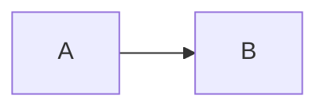

# 🧜 Mermaid Viewer

A static Mermaid editor and previewer for comparing layout engines and checking how an explicit Mermaid layout directive will behave before publishing a diagram elsewhere.

The viewer supports:

- `elk` — ELK (Eclipse Layout Kernel)
- `tidy-tree` — hierarchical/tree-oriented layout
- `cose-bilkent` — force-directed graph layout
- `dagre` — layered graph layout

**Auto-detect is the default mode.** If the Mermaid source does not specify a layout, the viewer falls back to **ELK**.

Official Mermaid layout documentation:

- https://mermaid.ai/open-source/config/layouts.html

## Features

- ✍️ Live Mermaid editor
- 🧭 ELK, Tidy Tree, Cose Bilkent and Dagre layout comparison
- 🔎 **Auto-detect `config.layout` from Mermaid YAML frontmatter**
- 📌 Manual **force layout** mode for preview comparisons without rewriting the editor source
- ⭐ ELK fallback when Auto-detect finds no source layout
- 🔎 Smooth mouse-wheel zoom centred on the pointer
- 🖐️ Click-and-drag panning
- 🎯 Fit-to-window and 100% controls
- ⛶ Full-screen preview
- 🎨 Light and dark Mermaid themes
- 📐 Configurable render width
- 📌 Arbitrary semantic-version testing with explicit integrity state
- 🔽 Trusted-version dropdown for Mermaid 11.15.0 and 11.17.2
- ✅ Repository-controlled SHA-384 verification for bundled trusted versions
- ⚠️ Per-version consent before an unknown Mermaid version is downloaded from a CDN
- 💾 Browser `localStorage` persistence
- 🧹 Blank input clears the preview rather than producing Mermaid's syntax-error graphic
- 🔐 Mermaid `securityLevel: "strict"`
- 🧱 Sandboxed renderer without same-origin privileges
- 🚀 Static GitHub Pages deployment
- 🧪 Node.js unit and vendored-artefact checks

## Layout auto-detection

Mermaid Viewer understands an explicit layout in Mermaid frontmatter:



With **Auto-detect** enabled, the viewer uses `dagre` for that source. The same applies to `elk`, `tidy-tree` and `cose-bilkent` when the selected diagram family supports the layout.

The viewer also recognises the older flowchart renderer hints:

```yaml
---
config:
  flowchart:
    defaultRenderer: dagre-wrapper
---
```

### Auto-detect behaviour

| Source | Viewer behaviour |
| --- | --- |
| `config.layout: elk` | Uses ELK |
| `config.layout: dagre` | Uses Dagre |
| `config.layout: tidy-tree` | Uses Tidy Tree when compatible |
| `config.layout: cose-bilkent` | Uses Cose Bilkent when compatible |
| No layout directive | Uses ELK fallback |
| Unknown layout | Blocks Auto-detect and reports the unsupported value |

The status beside the selector makes the decision visible, for example:

```text
AUTO · source: Dagre
AUTO · no source layout · ELK fallback
FORCED · ELK
```

### Force mode

Selecting a layout manually switches the viewer to **forced mode**.

If the source contains:

```yaml
---
config:
  layout: dagre
---
```

and you manually select ELK, Mermaid Viewer creates an internal render copy containing `layout: elk`. The textarea remains unchanged.

This is intentional: **forced mode is a preview tool, not a source editor**. If you want another platform to receive a particular layout directive, put that directive in the Mermaid source itself and use Auto-detect to verify it.

## GitHub-oriented workflow

For diagrams intended for GitHub:

1. Put the layout you intend to publish in Mermaid frontmatter.
2. Click **Auto-detect**.
3. Confirm the viewer reports the expected source layout.
4. Compare with other layouts manually if useful.
5. Return to Auto-detect before copying/committing the source.

Mermaid Viewer can confirm what the source requests; it cannot guarantee that every external host has every optional Mermaid layout provider enabled. Explicit source configuration is therefore preferable to depending on a host's implicit default.

## Project structure

```text
.
├── .github/
│   └── workflows/
├── public/
│   ├── index.html
│   ├── renderer.html
│   └── assets/
│       ├── css/
│       ├── images/
│       └── js/
│           ├── app.js
│           ├── core.js
│           ├── integrity.js
│           ├── protocol.js
│           ├── renderer.js
│           └── externals/
├── scripts/
├── tests/
├── ARCHITECTURE.md
├── CHANGELOG.md
├── LICENSE
├── README.md
├── SECURITY.md
└── package.json
```

See [ARCHITECTURE.md](ARCHITECTURE.md) for the rendering boundary, integrity model and layout-resolution flow. Release history is in [CHANGELOG.md](CHANGELOG.md).

## Run locally

From the repository root:

```bash
python -m http.server 8000 --directory public
```

Then browse to:

```text
http://localhost:8000/
```

## Tests

Install the exact development dependencies from `package-lock.json`, then run:

```bash
npm ci
npm run check
```

The v1.3 layout tests cover:

- all four `config.layout` values;
- quoted values and YAML comments;
- inline `config: { ... }` mappings;
- legacy `config.flowchart.defaultRenderer` hints;
- missing and unsupported layout directives;
- ELK fallback in Auto-detect mode;
- forced layout insertion/replacement;
- preservation of the user's original editor source;
- mode normalisation and migration behaviour.

The existing test suite continues to cover version validation, integrity verification, CDN consent, sandbox/message validation, zoom/fit calculations and static deployment assertions.

## Mermaid versions and integrity

The default trusted Mermaid version is `11.15.0`; `11.17.2` is also bundled and verified. Other complete semantic versions can be tested only after explicit unverified-version consent.

The three integrity states remain:

1. **Verified** — every executable in the selected rendering stack has a repository-controlled digest and matches it.
2. **Unverified** — integrity metadata is absent and the user explicitly approved that Mermaid version.
3. **Integrity failure / blocked** — expected bytes do not match; execution is blocked with no override.

See [SECURITY.md](SECURITY.md) for details.

## Security model

Rendering remains isolated in `renderer.html` using:

```html
sandbox="allow-scripts"
```

`allow-same-origin` remains omitted. Mermaid runs with `securityLevel: "strict"`, and trusted executable artefacts retain the repository-controlled SHA-384 verification introduced in v1.2.0.

The v1.3 frontmatter detector is intentionally narrow: it reads only the layout keys required by Mermaid Viewer and does not evaluate YAML or execute configuration as code.

## GitHub Pages

The existing Pages workflow publishes `./public` after validation. Configure **Settings → Pages → Source → GitHub Actions** for a new repository.

## Repository

https://github.com/safesploitOrg/mermaid-viewer

## Licence

MIT. See [LICENSE](LICENSE).
